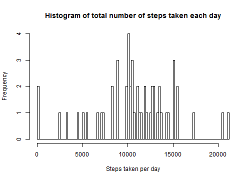
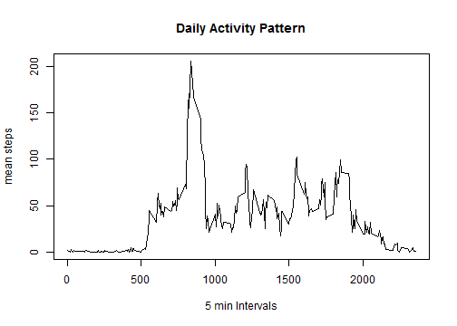
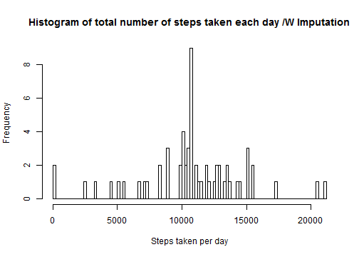
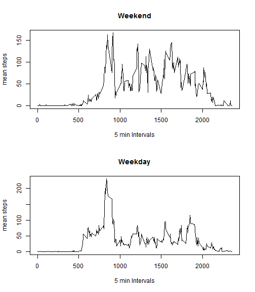

#"Reproducible Research: Peer Assessment 1"
---
title: "Reproducible Research: Peer Assessment 1"
output: 
  html_document:
    keep_md: true
---


## Loading and preprocessing the data

```r
act<-read.csv("activity.csv")
summary(act)
```

```
##      steps                date          interval     
##  Min.   :  0.00   2012-10-01:  288   Min.   :   0.0  
##  1st Qu.:  0.00   2012-10-02:  288   1st Qu.: 588.8  
##  Median :  0.00   2012-10-03:  288   Median :1177.5  
##  Mean   : 37.38   2012-10-04:  288   Mean   :1177.5  
##  3rd Qu.: 12.00   2012-10-05:  288   3rd Qu.:1766.2  
##  Max.   :806.00   2012-10-06:  288   Max.   :2355.0  
##  NA's   :2304     (Other)   :15840
```
As shown, some NA cases exist in the 'steps' variable. 
 
## What is mean total number of steps taken per day?
First, total steps of each day were counted, and a histogram of steps per day is shown as below.

```r
daysum<-aggregate(act$steps, list(act$date), sum)
colnames(daysum)<-c("Date","DaySteps")
```

```r
hist(daysum$DaySteps, breaks = 100, xlab="Steps taken per day", main = "Histogram of total number of steps taken each day")
```

 
  
Mean and mediam of daily steps were computed, ignoring days where data is not available.

```r
mean1<-mean(daysum$DaySteps, na.rm=TRUE)
med1<-median(daysum$DaySteps, na.rm=TRUE)
MissingDays<-which(is.na(daysum$DaySteps))
num_md<-length(MissingDays)
```
Among all dates in the activity table, there are 8 days where data on steps were missing. Excluding these days, the mean of total number of steps is 1.0766189 &times; 10<sup>4</sup> and the median is 10765.


## What is the average daily activity pattern?
Since all intervals have missing data, they are ignored here and essentially computed as zeros. 

```r
act_c<-subset(act, !is.na(act$step))
hourmean<-aggregate(act_c$steps, list(act_c$interval), mean)
colnames(hourmean)<-c("Time","MSteps")
```
Below is a time series plot of the 5-minute interval and the average number of steps taken, averaged across all days


```r
plot(hourmean$Time, hourmean$MSteps, type = "l", xlab = "5 min Intervals", ylab = "mean steps", main="Daily Activity Pattern")
```

 
  

```r
maxIn<-hourmean$Time[which.max(hourmean$MSteps)]
```
The maximum number of steps occured in the interval of 835. 

## Imputing missing values
Calculate and report the total number of missing values in the dataset
(i.e. the total number of rows with NAs)

```r
nrows_missing<-
sum(as.numeric( is.na(act$steps) | is.na(act$date) | is.na(act$interval)) )
```
There are 2304 rows with missing values in the dataset, as also reflected in the summary table in the beginning of data set. All missing value are in the column "steps"

To impute missing values, each interval that is missing a value in 'steps' is replaced with the mean steps of the same interval across all days.

```r
filler<-merge(act[is.na(act$steps),], hourmean, by.x="interval", by.y = "Time", all.x=TRUE) 
fitfiller<- filler[ , c("MSteps", "date", "interval")]
names(fitfiller)<-c("steps", "date","interval")
act_filled<-rbind(fitfiller,act_c)
```

With the new imputed and complete dataset, the histogram of total number of steps is as shown below.

```r
daysum2<-aggregate(act_filled$steps, list(act_filled$date), sum)
colnames(daysum2)<-c("Date","DaySteps")
```

```r
hist(daysum2$DaySteps, breaks = 100, xlab="Steps taken per day", main = "Histogram of total number of steps taken each day /W Imputation")
```

 

Now comparing this imputed dataset with the actual dataset

```r
mean2<-mean(daysum2$DaySteps, na.rm=TRUE)
med2<-median(daysum2$DaySteps, na.rm=TRUE)
MissingDays<-which(is.na(daysum$DaySteps))
num_md<-length(MissingDays)
meandiff <-mean2-mean1
meddiff<-med2-med1
```
With the missing values imputed, the mean of total number of steps is 1.0766189 &times; 10<sup>4</sup> and the median is 1.0766189 &times; 10<sup>4</sup>. The difference from the actual dataset is: 0 in mean and 1.1886792 in median. There seemed to be a slight increase in median, but mean stayed the same.The mean stayed the same because the missing data happened to be of all the intervals of 8 full days, and when imputed as described above, these 8 full days were represented by average steps in each time interval, rendering average daily performance each day, thus keeping the imputed mean the same. The median moved a little because the with the imputed daily activity, there are 8 days with exactly the same activity (also non-integer steps numbers), which is now the median. This happened to be a slight increase from the previous median (which occured less frequently --4 times only)


## Are there differences in activity patterns between weekdays and weekends?
First, a new column ("weekend"is added to the dataframe indicating if a date is weekend (TRUE) or weekday(FALSE).

```r
act_filled[,"weekend"]<-weekdays(as.Date(act_filled$date)) %in% c("Sunday", "Saturday")
```
Compute weekday and weekend 5-min interval activities separately.

```r
act_weekend<-subset(act_filled, act_filled$weekend)
act_weekday<-subset(act_filled, !act_filled$weekend)
hourmean_end<-aggregate(act_weekend$steps, list(act_weekend$interval), mean)
hourmean_day<-aggregate(act_weekday$steps, list(act_weekday$interval), mean)
colnames(hourmean_end)<-c("Time","MSteps")
colnames(hourmean_day)<-c("Time","MSteps")
```
Plot two groups of activities in a panel plot. As is shown, weekend activities seemed to be more scattered throughout the day while weekday activities tend to peak at around 800 (8ish), which is possibly due to a more flexible schedule on weekends.

```r
par(mfrow = c(2,1))
plot(hourmean_end$Time, hourmean_end$MSteps, type = "l", xlab = "5 min Intervals", ylab = "mean steps", main="Weekend")
plot(hourmean_day$Time, hourmean_day$MSteps, type = "l", xlab = "5 min Intervals", ylab = "mean steps", main="Weekday")
```

 
